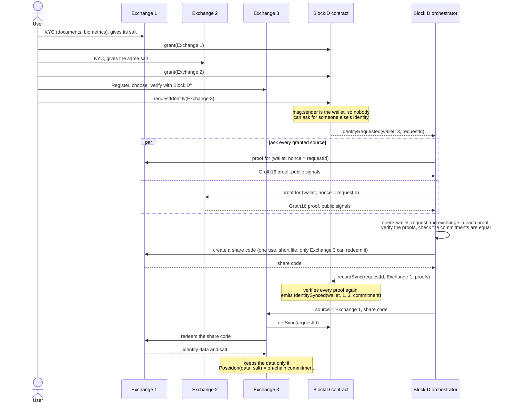

# BlockID

> ETHGlobal Istanbul hackathon project, November 2023. Restored in 2026: working ZK circuits, a plain-EVM contract with on-chain proof verification, the protocol as a tested module. Original code: tag [`original-2023`](https://github.com/urtuba/block-id/tree/original-2023).

**Live demo:** coming.

## The idea

KYC once, reuse everywhere, and BlockID never sees your data.

A user passes KYC at Exchange 1 and Exchange 2. Later the user signs up at Exchange 3 and clicks "verify with BlockID". BlockID asks Exchange 1 and Exchange 2 for zero-knowledge proofs, and checks that both hold the same identity, without seeing it. Then it opens a short-lived channel, and Exchange 3 gets the data straight from one of the two. BlockID only sees proofs and a commitment, never a name or an ID number. The sync is recorded on a blockchain, so anyone can check that the sources held the same identity.

The [litepaper](BlockID%20Protocol%20Litepaper.pdf) describes the idea.

## Team

Five people built the 2023 version. The areas are taken from `git log` at the tag `original-2023` (which folders each person's commits touched), not from memory.

| Who | Commits | Main area |
|---|---|---|
| Samed Kahyaoglu ([@urtuba](https://github.com/urtuba)) | 45 | The demo exchange backend (`client-server`), the orchestrator (`block-id-server`), the protocol sequence diagram |
| ugurcanuncuoglu ([@ugurcanuncuoglu](https://github.com/ugurcanuncuoglu)) | 27 | The exchange front end (`front-end/hinance`) and the landing page, the zkSync contracts (`aa-contracts`) |
| Toprak Keskin ([@toprakkeskin](https://github.com/toprakkeskin)) | 22 | The ZK circuits, the trusted setup scripts and the proof SDK (`block-id-chain/zk`, `block-id-sdk`) |
| Oguz Dogan ([@oguz-dogan](https://github.com/oguz-dogan)) | 3 | The favicon |
| defunicorn ([@defunicorn](https://github.com/defunicorn)) | 1 | The litepaper |

The 2026 restoration (circuits, contract, protocol module, tests) was done with an AI agent, Claude Sonnet 5.5; each commit says so.

## How it works

**Identity commitment.** The four identity fields (full name, identity number, nationality, date of birth) become field elements, and the user has a secret `salt`. The commitment is

```
identityCommitment = Poseidon(fullName, identityNumber, nationality, dateOfBirth, salt)
```

The salt keeps BlockID from brute-forcing a low-entropy field such as an ID number from the public commitment. In the protocol it comes from a wallet signature, and the user gives it to each exchange at KYC time. Two exchanges that hold the same data and the same salt compute the same commitment.

**The circuit** (`circuits/identity-proof.circom`, Groth16, 324 constraints) proves: "I know the identity behind this commitment, and I am saying so for this wallet, as this exchange, in answer to this request."

| Signal | Kind | Meaning |
|---|---|---|
| `fullName`, `identityNumber`, `nationality`, `dateOfBirth`, `salt` | private | the committed data |
| `identityCommitment` | public | `Poseidon(...)` of the five private values, checked in the circuit |
| `wallet` | public | the user's address as a number |
| `clientId` | public | the exchange that made the proof |
| `nonce` | public | the on-chain request id |

Every public signal is used in a constraint, so a proof cannot be moved to another wallet, exchange or request. The tests check this on the proof, on the verification key and on the r1cs.

**The sequence:**



This follows the [2023 sequence diagram](suplementary-materials/id-sharing-protocol-seq-diagram.txt), which is still in the repo. The new flow differs in four places: the user's request names no wallet (the contract uses `msg.sender`); proofs are bound to the wallet, the exchange and the request; the share code can only be redeemed by the target exchange, so BlockID cannot read the data itself; and the target checks the data it receives against the commitment on-chain.

**The contract** (`contracts/contracts/BlockID.sol`, plain EVM, solc 0.8.37):

| Function | Who | What |
|---|---|---|
| `addClient(name, url)` | owner | registers an exchange, returns its id (1, 2, ...) |
| `setOrchestrator(address)` | owner | who may call `recordSync` |
| `grant(clientId)`, `revoke(clientId)` | wallet | allows or stops an exchange acting as a source for the sender's identity |
| `getGrants(wallet)`, `isGranted(wallet, clientId)` | anyone | reads the grants |
| `requestIdentity(targetClientId)` | wallet | asks for a sync to the target; needs at least `minSources` granted sources besides the target; emits `IdentityRequested(wallet, targetClientId, requestId)` |
| `recordSync(requestId, sourceClientId, proofs)` | orchestrator | verifies the proofs on-chain, emits `IdentitySynced(wallet, sourceClientId, targetClientId, identityCommitment)` |
| `getClient`, `getRequest`, `getSync` | anyone | reads exchanges, requests and results |

`recordSync` checks, on-chain, for every proof: the Groth16 proof verifies; it is for the request's wallet; its nonce is the request id; its exchange is distinct from the others, is granted by the wallet right now, and is not the target. It also checks that there are at least `minSources` proofs (2 in the demo), that all identity commitments are equal, that the chosen data source is one of the proven exchanges, and that the request was not synced before. The proofs stay in the transaction data, so anyone can verify them again. No personal data is stored or emitted. Two proofs cost about 0.52M gas.

**The protocol module** (`block-id-sdk`, ES module, works in Node and in the browser, no Express, no database):

- Encoding: `encodeIdentity`, `identityCommitment`, `deriveSalt(signature)` with `SALT_MESSAGE`, `randomSalt`, `walletToField`.
- Proofs: `proveIdentity`, `verifyIdentityProof`, `proofToCalldata`, `parsePublicSignals`.
- `Exchange`: `storeKyc`, `provideProof`, `createShareCode`, `redeemShareCode` (source side), `receiveShare` (target side).
- `Orchestrator`: `handleRequest(requestId)`, `watch()`. Chain access and transport are injected.
- `createChain(contract)` wraps an ethers contract. `MemoryNetwork` is an in-memory transport for tests and the browser demo.
- `block-id-sdk/node` has `circuitArtifacts()`, the committed artifacts as file paths (Node only).

## Repo layout

Current:

| Folder | What |
|---|---|
| `circuits/` | the circuit, the build and verify scripts, the committed artifacts, the circuit tests |
| `contracts/` | `BlockID.sol`, the verifier generated by snarkjs, `contract-data.js` (ABI and bytecode), the contract tests |
| `block-id-sdk/` | the protocol module and its tests, including the end-to-end test |
| `.github/workflows/` | CI |
| `suplementary-materials/` | the 2023 sequence diagram |

2023 reference, kept as it was and not maintained (each has a README): `aa-contracts/` (zkSync contracts), `block-id-server/` (orchestrator), `client-server/` (demo exchange backend), `front-end/hinance/` (exchange UI), `front-end/block-id-landing/` (landing page). The 2023 circuits, SDK and `block-id-chain` are only at the tag.

## Running the tests

You need Node 22.

```
npm ci
npm test
```

This runs the tests of the three packages in turn; `npm test -w circuits`, `-w contracts` and `-w block-id-sdk` run one. The first run of the contract tests downloads the Solidity compiler.

- **circuits**: valid proofs verify; a changed public signal fails; the same data and salt give the same commitment and any changed field gives another; a wrong witness cannot be proven; every public signal is bound; the committed key, verifier and powers-of-tau hash match.
- **contracts**: the verifier accepts a real proof and nothing else; every path of `BlockID`, with real proofs; `contract-data.js` matches the build.
- **block-id-sdk**: unit tests, and one end-to-end test: `BlockID` on a Hardhat chain, three exchanges, a user with KYC at 1 and 2 who asks for 3. It also covers different data at the two sources, proofs for another wallet or request, reused and expired share codes, and a request from a wallet that did not grant.

CI runs the same on every push and pull request. It uses the committed artifacts and recompiles no circuit.

## Regenerating the circuit

Only needed when the circuit changes.

```
npm run build -w circuits          # compile, setup, write artifacts and the Solidity verifier
npm run export-contract -w contracts
npm test
```

The build downloads the Hermez powers of tau file `powersOfTau28_hez_final_09.ptau` (2^9, 0.7 MB), the smallest one that fits 324 constraints, and checks its blake2b hash against the one in the snarkjs README. The file goes to `circuits/build/` and is never committed (`*.ptau` is git-ignored). The phase-2 setup uses one contribution with random entropy that is thrown away, so every build gives new keys: commit `circuits/artifacts/` and `contracts/contracts/IdentityProofVerifier.sol` together. The tests fail if they do not match.

`npm run verify -w circuits` checks that the committed zkey belongs to the committed r1cs and the powers of tau file.

Tools: circom2 0.2.23 (circom 2.2.3) and snarkjs 0.7.6, from npm. Committed artifacts: `identity-proof.wasm` 2.1 MB, `identity-proof.zkey` 0.46 MB, `identity-proof.r1cs` 0.3 MB, `vkey.json` 3 KB.

## Known limitations

- **The trusted setup is demo-grade.** Phase 1 is the public Hermez ceremony. Phase 2 is one contribution by whoever runs the build, with entropy that is not kept. Nobody can prove it was thrown away, and whoever kept it could forge proofs that the contract accepts. A real deployment needs a multi-party phase 2 and a random beacon.
- **The salt scheme has costs.** The salt comes from a wallet signature, which only works with wallets that sign deterministically (MetaMask does). The user gives the salt to every exchange, and the source sends it to the target with the data. An exchange that knows identity and salt can recognize the user's commitment on-chain; if the salt leaks, the commitment of low-entropy data can be brute-forced. A site that gets the signature of `SALT_MESSAGE` gets the salt.
- **The chain is public.** Observers see the wallet, the exchanges and the commitment of every sync. The same identity and salt always give the same commitment, so a person's syncs are linkable. It is pseudonymous, not anonymous.
- **Exchanges are trusted to hold correct data.** A proof says that an exchange knows data behind a commitment, not that the data is true or that KYC happened. There is no signature on the proof, so an exchange that knows the data can claim another exchange's id. The cross-check only helps when at least one source is honest and independent. The module also trusts an exchange to check that a user owns the wallet before it links the wallet to a KYC record.
- **Authentication is not part of the module.** An exchange should answer proof requests only for BlockID, and `redeemShareCode` trusts its `requester` argument, which the transport must set from a real authentication (signed requests, for example). `MemoryNetwork` does this by construction; nothing here does it over a network.
- **Text must match.** Exchanges have to write the name and ID the same, apart from case, spacing and Unicode normalization (NFC). There is no transliteration and no accent stripping. A difference gives a different commitment, so the sync fails safely. A date of birth must be `YYYY-MM-DD`.
- **One orchestrator account.** It can delay or refuse a sync, and it picks the data source. It cannot fake a proof or read the data. Nothing here runs an orchestrator as a service.
- **The contract is simple.** `minSources` is fixed at deployment. Exchanges cannot be changed or removed. A request has no expiry (revoking a grant stops it). The owner is a single key. There is no spam protection, and it was never audited or deployed to any network.
- **A sync copies data.** Revoking a grant does not delete what an exchange already received.
- **Toolchain.** The verifier is generated by snarkjs and keeps its GPL-3.0 header. The wasm is 2.1 MB, mostly circom's runtime. The `.ptau` link in the snarkjs 0.7.6 package README (storage.googleapis.com) now answers 403, so the script uses the link from the snarkjs main branch (circom.info); the hash is the same, and the download is checked against it.

## License

MIT, Copyright (c) 2023 Samed Kahyaoglu. See [LICENSE](LICENSE).
